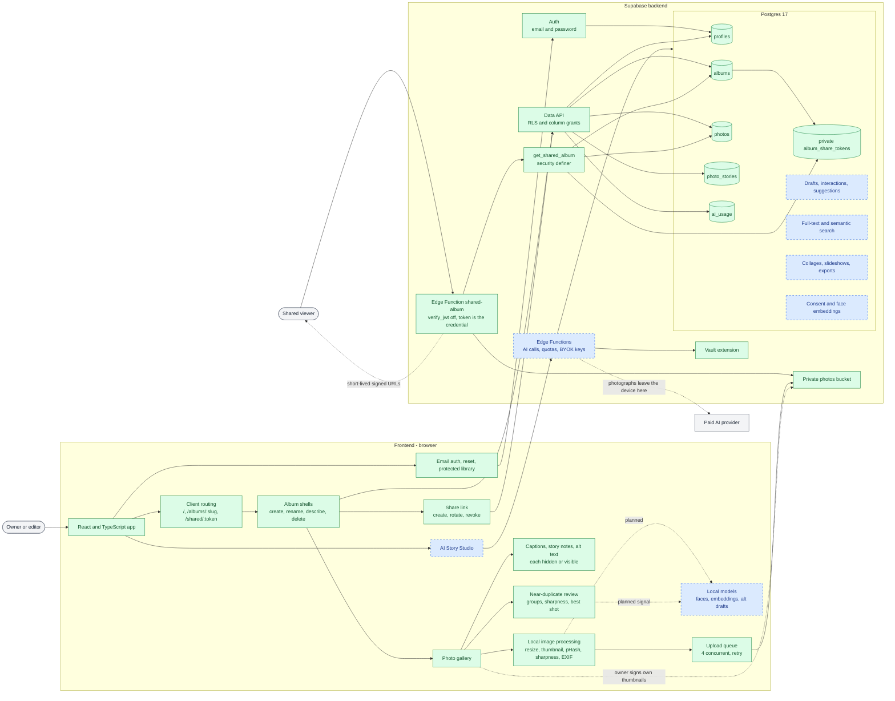
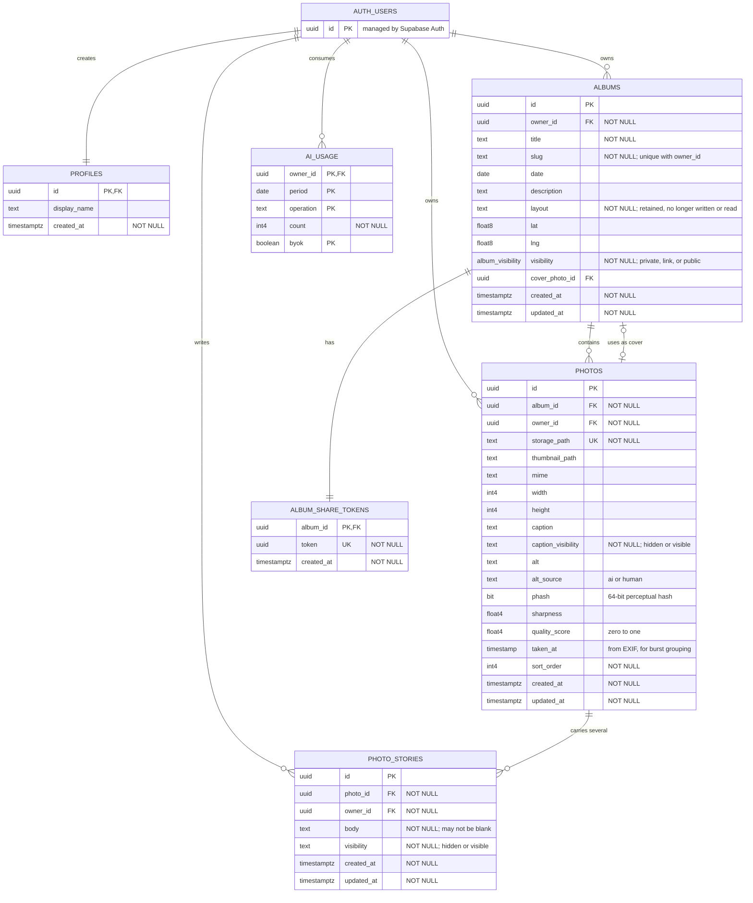
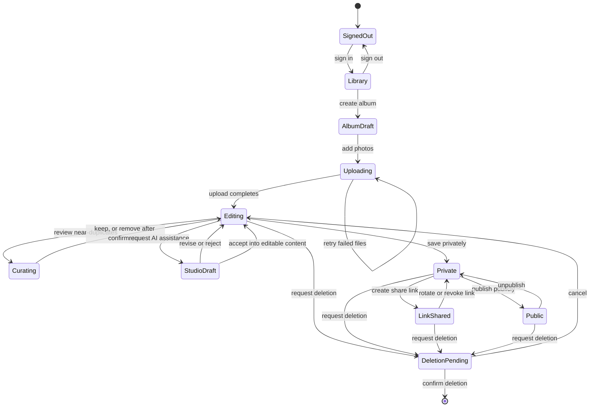

# Albums Studio project structure

This is the living visual map of the project. Green nodes exist now; blue dashed nodes are
planned by the roadmap. Authentication, albums, upload, owner text, sharing and near-duplicate
review exist; AI generation and its trusted server functions remain planned.

## Models and libraries

Nothing in the product runs a machine-learning model today. Every signal it shows — the
near-duplicate groups, the sharpness reading, the best shot, the burst grouping — is
arithmetic over measurements the browser takes at upload time. That is the baseline this
table exists to protect: a model earns a row here only when a deterministic method cannot do
the job.

Read `Status` before anything else. `Blocked` means a licence or a product invariant rules
the model out, not that it performed badly.

| Model or library | Job | Where it runs | Licence | Status |
| --- | --- | --- | --- | --- |
| pHash (DCT), project code | Near-duplicate grouping | Browser | Project code | Shipped |
| Laplacian sharpness, project code | Best-shot ranking | Browser | Project code | Shipped |
| EXIF timestamps, project code | Burst grouping | Browser | Project code | Shipped |
| Face detector and landmarks | Faces visible, eyes open | Browser, WASM | Apache-2.0, bundle still to confirm | Candidate, Phase 7 |
| CLIP or SigLIP | Semantic search embeddings | Browser, ONNX | MIT, Apache-2.0 | Candidate, Phase 10 |
| Florence-2-base | Alt text drafts | Browser, WebGPU | MIT | Candidate, Phase 11 |
| SmolVLM 256M and 500M | Alt text drafts | Browser, WebGPU | Apache-2.0 | Candidate, Phase 11 |
| Hosted vision model | Alt drafts, Story Studio | Edge Function to provider | Commercial terms | Planned, Phases 5 and 11 |
| Whisper | Voice transcription | Browser or hosted | MIT | Unmeasured, Phase 5 |
| InsightFace `buffalo_*`, ArcFace | Face grouping embeddings | Browser, ONNX | Code MIT, weights non-commercial research only | Blocked for a paid tier |

Three rules decide the `Where it runs` column, and between them they are why no Python
library appears:

- The deploy targets are Vercel for the static application and Supabase Edge Functions on
  Deno. There is no Python runtime here, so a Python library needs a host this project does
  not have, and photographs would have to leave the browser to reach it.
- A model that runs in the browser never lets a photograph leave the device. A hosted model
  does, which is why one may only ever be reached through trusted server code.
- Provider keys live in the Vault and are used from Edge Functions. They never reach the
  browser, so no model call may be made from it.

## Frontend and backend architecture



## Current data model

This diagram reflects the live schema. `PK` means primary key, `FK` means foreign key, and
`UK` means unique. Required fields are labeled `NOT NULL`.



The human-facing text fields have separate purposes:

- `albums.title` is editable; `albums.slug` is not. The slug is the stable half of the
  `/albums/:slug` address, so a rename must not move it.
- `albums.layout` no longer selects anything. The masonry/grid switch was withdrawn on
  2026-08-22 — the two were indistinguishable for a phone album, and masonry read the
  owner's ordering down the columns while Move earlier and Move later promise it runs across
  the rows. The column, its check constraint and its grants are retained untouched; the
  client neither writes nor reads it, and Phase 7.5 picks it back up.
- `albums.description` describes the album as a whole.
- `photos.caption` provides context for one photo, and `photos.caption_visibility` decides
  whether a shared viewer ever reads it. Hidden is the default.
- `photos.alt` is owner-approved accessibility text for screen readers. It is delivered to
  everyone who needs it whatever the caption choice was.
- `photos.alt_source` records whether the current alt text originated from AI or a human, so
  a later draft cannot quietly overwrite a person's wording.
- `photo_stories.body` is the longer version, several per photo, each with its own
  visibility. A blank story is not stored; clearing the text is how one is deleted.

`album_share_tokens` belongs to the private schema and is never exposed as ordinary album
data. Supabase manages `auth.users`; the application owns the other tables shown here.

## Album lifecycle

This state machine describes the intended product workflow. It is not a database status
enum; only visibility and durable content states are persisted.



## Repository layout

```text
albums-studio/
|-- src/
|   |-- components/              current screens and shared UI
|   |-- lib/                     current data access and helpers
|   |   |-- imaging/             current resize, thumbnail, pHash, sharpness, EXIF
|   |   |-- similarity.ts        current near-duplicate and burst grouping
|   |   `-- focus.ts             current out-of-focus reading against an absolute floor
|   `-- *.test.tsx               current component and state-machine tests
|-- e2e/                         current Playwright suites, including axe checks
|-- .github/workflows/ci.yml     current typecheck, tests, build, end-to-end
|-- supabase/
|   |-- config.toml              current local Supabase configuration
|   |-- migrations/              current schema history and source of truth
|   |-- checks/                  current probes run against the real database
|   `-- functions/shared-album/  current trusted Edge Function for share links
|-- docs/
|   |-- project-structure.md     this visual architecture map
|   |-- plans/                   phased roadmap
|   `-- sessions/                durable decision history
|-- AGENTS.md                    repository guidance
`-- README.md                    project overview
```

## Routing

Addresses are history-API routes, not hash routes: Supabase delivers recovery and
magic-link tokens in the URL hash, which a hash router would consume before the client
reads them. `vercel.json` rewrites every path to `index.html` so a deep link survives a
reload in production.

| Path | Screen |
| --- | --- |
| `/` | Library: album list and creation |
| `/albums/:slug` | One album: photos, text, curation, sharing, delete |
| `/shared/:token` | Shared album for a visitor with no account |
| anything else | Redirected to `/` |

`/shared/:token` is matched before the authentication gate, not inside it: a shared album
belongs to someone who has no account and must never be sent to a sign-in screen.

## Serving this map inside the application

The map is readable at `/architecture.html` in the running application, linked from the foot
of the library. It is an ordinary static file in `public/`, generated from the published
artifact.

It was briefly something more elaborate: an Edge Function that identified the caller before
releasing the markup, so the page reached one account and nobody else. That was deleted on
2026-08-27, because the premise was wrong rather than the code. **This repository is
public.** The same diagrams, the same registry and the same schema sit in this file, and the
page's entire HTML sat in the function's own `page.ts`, both readable by anyone. A gate in
front of a document that GitHub already serves is not a boundary, it is ceremony — and it
cost a deploy step, a project secret and an environment variable to maintain.

The judgement to re-examine if this repository ever becomes private: at that point the map
would be public while the code was not, and the deleted function is in the history under
`Serve the architecture map to the owner, at /architecture (#41)`.

The page reaches two hosts of its own — Google Fonts for its type and jsDelivr for Mermaid.
A blocked network degrades it to fallback fonts and unrendered diagram source rather than
breaking the page, which is the behaviour to keep if either is ever replaced.

## Keeping this file true

A published version of this map, with the registry as its front page, is at
https://claude.ai/code/artifact/8f184f77-3b90-474e-b0f6-afa70742af71 — republish it from the
same pull request that changes this file, so the two never disagree.

Update this file in the same pull request that changes what it draws. In particular, a pull request
that adopts, replaces, or rules out a model or library must land its row in
`Models and libraries` — licence included — in that same pull request. A model that reaches
the repository before it reaches this table is how a non-commercial licence gets adopted by
accident.

Keep implementation detail in the roadmap or in feature-specific documents rather than
expanding this into a second plan.
