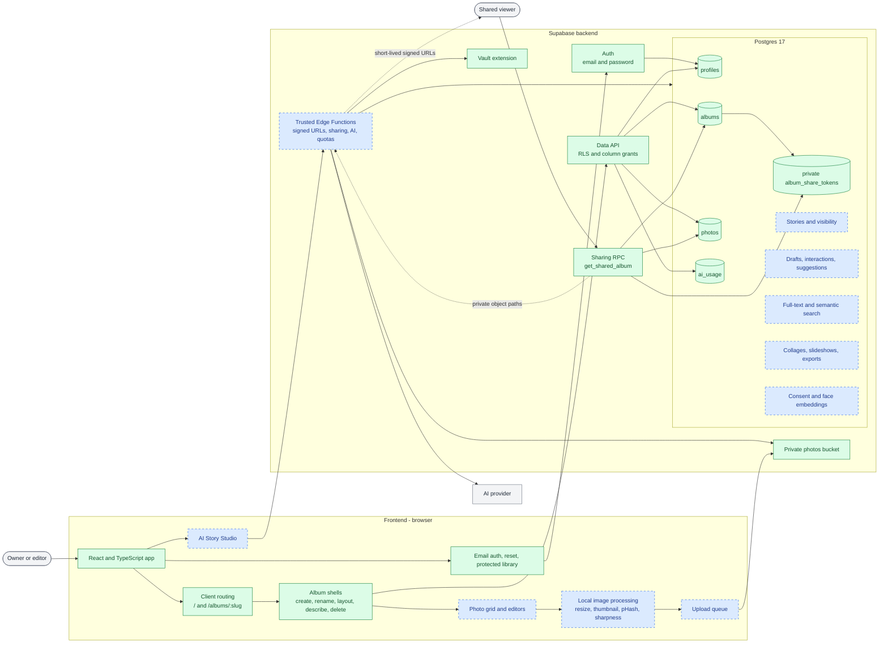
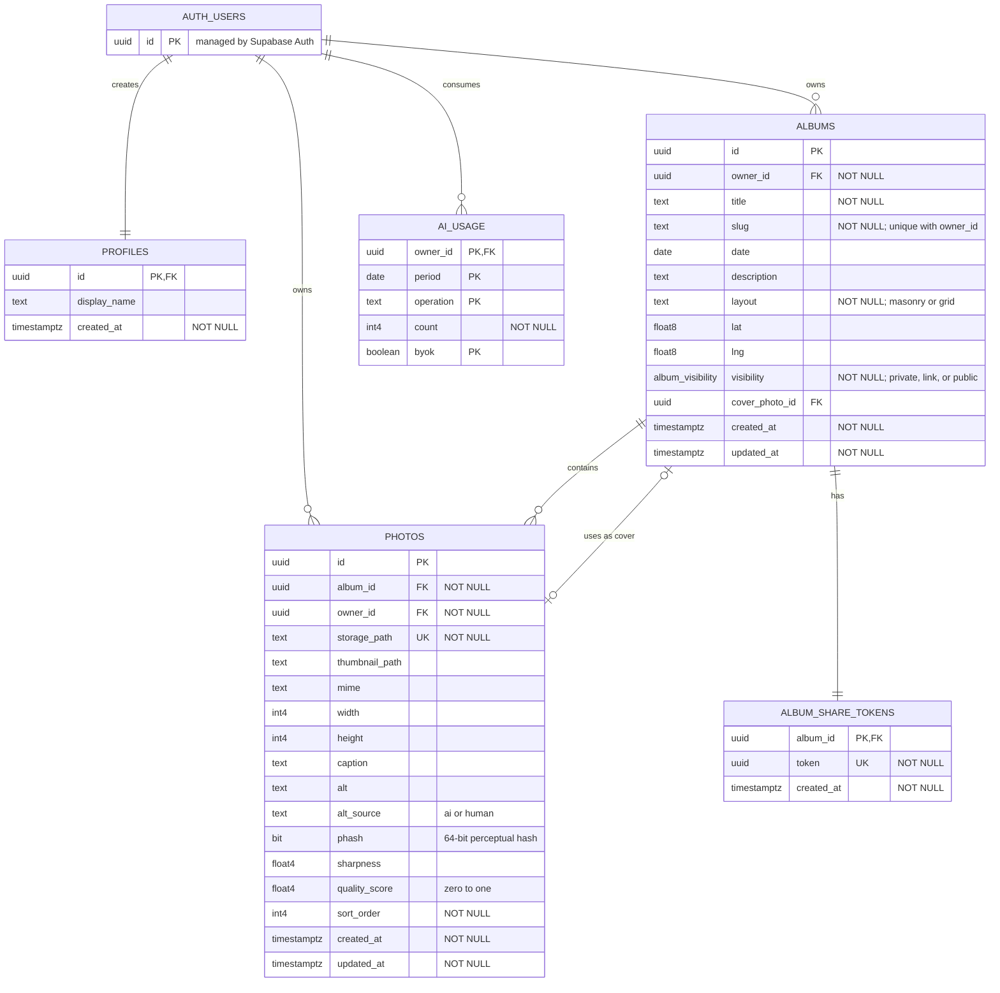
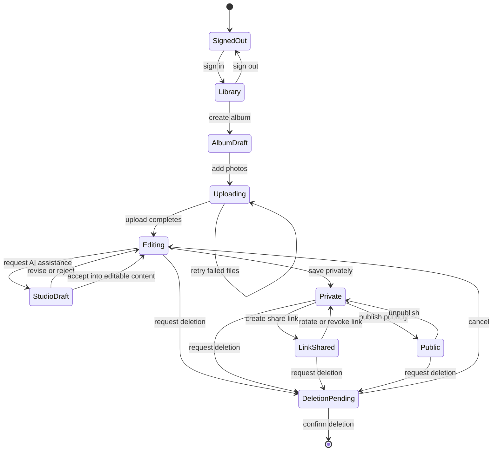

# Albums Studio project structure

This is the living visual map of the project. Green nodes exist now; blue nodes are planned
by the roadmap. Authentication and album shells exist; photo upload, AI, and trusted server
functions remain planned.

## Frontend and backend architecture



## Current data model

This diagram reflects the live schema. `PK` means primary key, `FK` means foreign key, and
`UK` means unique. Required fields are labeled `NOT NULL`.



The human-facing text fields have separate purposes:

- `albums.title` is editable; `albums.slug` is not. The slug is the stable half of a future
  share URL and of the current `/albums/:slug` address, so a rename must not move it.
- `albums.layout` selects the presentation. Its check constraint lists only the layouts the
  application can draw today, and each later phase widens it when it ships the renderer.
- `albums.description` describes the album as a whole.
- `photos.caption` provides visible context for one photo. Caption visibility is planned but
  is not yet stored separately.
- `photos.alt` is owner-approved accessibility text for screen readers.
- `photos.alt_source` records whether the current alt text originated from AI or a human.

`album_share_tokens` belongs to the private schema and is never exposed as ordinary album
data. Supabase manages `auth.users`; the application owns the other tables shown here.

## Album lifecycle

This state machine describes the intended product workflow. It is not a database status
enum; only visibility and durable content states should be persisted when their phases are
implemented.



## Repository layout

```text
albums-studio/
|-- src/
|   |-- components/              current screens and shared UI
|   |-- lib/                     current data access and helpers
|   `-- *.test.tsx               current component and state-machine tests
|-- e2e/                         current Playwright suites, including axe checks
|-- .github/workflows/ci.yml     current typecheck, tests, build, end-to-end
|-- supabase/
|   |-- config.toml              current local Supabase configuration
|   |-- migrations/              current schema history and source of truth
|   `-- functions/               planned trusted Edge Functions
|-- docs/
|   |-- project-structure.md     this visual architecture map
|   |-- plans/                   phased roadmap
|   `-- sessions/                durable decision history
|-- AGENTS.md                    repository guidance
`-- README.md                    project overview
```

## Routing

Addresses are history-API routes, not hash routes: Supabase delivers recovery and
magic-link tokens in the URL hash, which a hash router would consume before the client
reads them. `vercel.json` rewrites every path to `index.html` so a deep link survives a
reload in production.

| Path | Screen |
| --- | --- |
| `/` | Library: album list and creation |
| `/albums/:slug` | One album: rename, description, layout, delete |
| anything else | Redirected to `/` |

Update this file when a planned component becomes real or an architectural boundary
changes. Keep implementation details in the roadmap or feature-specific documents rather
than expanding this into a second plan.
