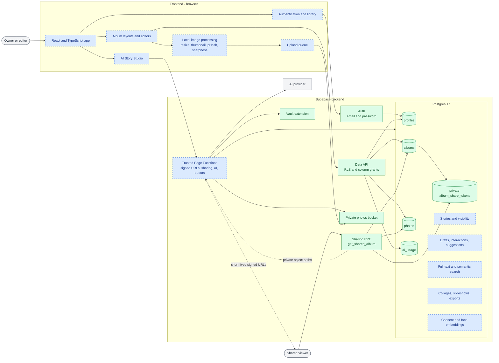
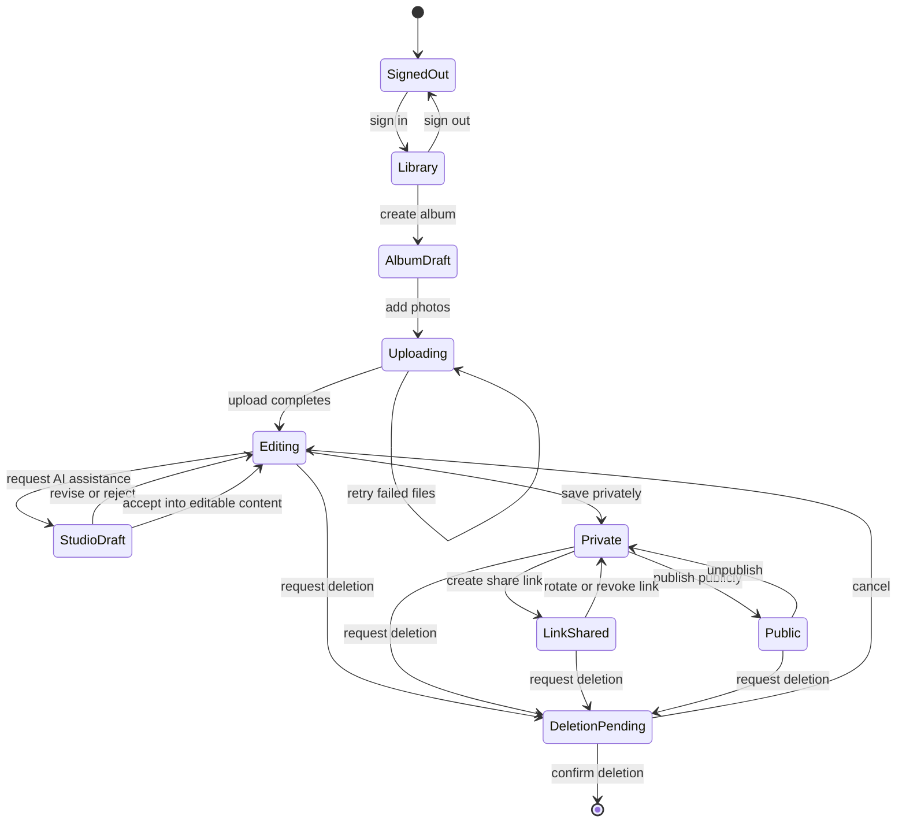

# Albums Studio project structure

This is the living visual map of the project. Green nodes exist now; blue nodes are planned
by the roadmap. The application frontend and trusted server functions have not been
scaffolded yet.

## Frontend and backend architecture



## Album lifecycle

This state machine describes the intended product workflow. It is not a database status
enum; only visibility and durable content states should be persisted when their phases are
implemented.



## Repository layout

```text
albums-studio/
|-- src/                         planned frontend application
|-- supabase/
|   |-- config.toml              current local Supabase configuration
|   |-- migrations/              current schema history and source of truth
|   `-- functions/               planned trusted Edge Functions
|-- docs/
|   |-- project-structure.md     this visual architecture map
|   |-- plans/                   phased roadmap
|   `-- sessions/                durable decision history
|-- AGENTS.md                    repository guidance
`-- README.md                    project overview
```

Update this file when a planned component becomes real or an architectural boundary
changes. Keep implementation details in the roadmap or feature-specific documents rather
than expanding this into a second plan.
